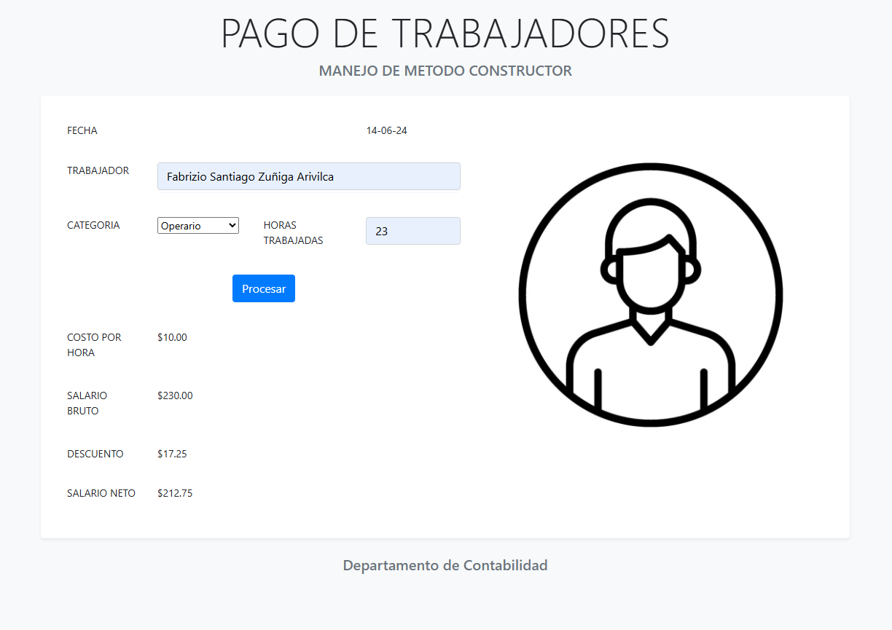

# Pago de Trabajadores

Este proyecto web desarrollado en PHP calcula el salario de los trabajadores en función de su categoría y las horas trabajadas.

## Imagen del Proyecto

## Características

- **Formulario de Entrada:** Permite ingresar el nombre del trabajador, la categoría y las horas trabajadas.
- **Cálculo de Pagos:** Calcula y muestra el costo por hora, el salario bruto, el descuento y el salario neto.
- **Diseño Responsivo:** Integración de Bootstrap 5 para un diseño atractivo y responsivo.
- **Imagen del Trabajador:** Muestra una imagen representativa del trabajador.

## Tecnologías Utilizadas

- **PHP:** Lógica del servidor y cálculos.
- **HTML/CSS:** Estructura y estilos básicos.
- **Bootstrap 5:** Framework de CSS para un diseño moderno y responsivo.

## Archivos Principales

- **index.php:** Página principal que contiene el formulario y la lógica de presentación.
- **pago.php:** Clase PHP que maneja los cálculos de pagos.
- **style.css:** Estilos personalizados adicionales.

